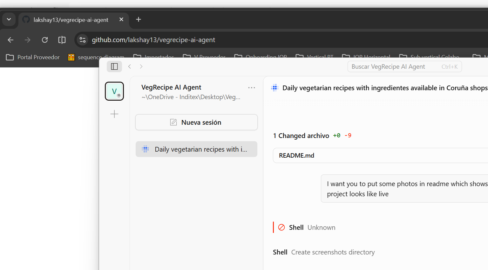

# 🥗 VegRecipe AI Agent

**VegRecipe AI Agent** is a daily vegetarian recipe suggester designed for **A Coruña, Galicia**. It recommends a new vegetarian recipe every day (or on demand with the surprise feature) and tells you exactly **which shops and supermarkets in A Coruña city center** sell each ingredient — including where to find Indian spices and specialty items.

> Built for vegetarians living in A Coruña who want easy access to global recipes with local shopping info.

---

## 📸 Screenshots



---

## ✨ Features

- **1125 vegetarian recipes** — Indian (North, South, Kerala, Indo-Chinese), Italian, Spanish, French, Chinese, Fusion, and more
- **Daily recipe** — deterministic day-of-year rotation
- **Surprise Me** — get a random recipe as many times as you want
- **Shopping list with local shops** — every ingredient mapped to real supermarkets in A Coruña center (Mercadona, Gadis, Hipercor, Supermercado Oriental, Lidl, Aldi, etc.)
- **Browse & filter** — by cuisine, meal type, or search by name/ingredient
- **Shops guide** — full directory of 11+ mapped shops with addresses and descriptions

---


---

## 🚀 Getting Started

### Prerequisites

- Python 3.12+
- pip

### Installation

```bash
# Clone the repo
git clone https://github.com/lakshay13/vegrecipe-ai-agent.git
cd vegrecipe-ai-agent

# Install dependencies
pip install -r requirements.txt
```

### Run the Web App (Streamlit)

```bash
streamlit run app.py
```

Or double-click `run-web.bat` on Windows.

This opens a browser at `http://localhost:8501` with tabs for today's recipe, browse, all recipes, and the shops guide.

### Run the CLI

```bash
python main.py            # Show today's recipe
python main.py random     # Show a random recipe
python main.py random 5   # Show 5 random recipes (no repeats)
python main.py list       # List all recipes
python main.py show 42    # Show recipe by ID
python main.py date 2026-12-25  # Recipe for a specific date
python main.py cuisines   # List all cuisines
python main.py by-cuisine Indian  # Filter by cuisine
```

Or double-click `run-cli.bat` on Windows.

---

## 🏪 Mapped Shops in A Coruña City Center

| Shop | Address | Best For |
|---|---|---|
| **Supermercado Oriental** | Rúa de San Andrés, 146 | Indian spices, lentils, paneer, ghee |
| **Mercadona** | Rúa da Falperra, 22-24 | Daily essentials, produce |
| **Hipercor (El Corte Inglés)** | Av. Pedro Barrié de la Maza, 29 | International section, premium items |
| **Gadis** | Rúa de Juan Flórez, 47 | Local Galician produce |
| **Lidl** | Rúa de Ramón y Cajal, 1 | Discount, Asian weeks |
| **Aldi** | Av. Pedro Barrié de la Maza, 31 | Budget-friendly basics |
| **Mercado de Abastos** | Praza de Lugo | Fresh local produce, herbs |
| **Mercado de San Agustín** | Praza de San Agustín | Traditional market |
| **Alahan Halal** | Rúa de San Andrés, 62 | Middle Eastern & South Asian |
| **Herbolario Navarro** | Rúa de San Andrés, 36 | Organic, health foods |
| **Vegalia** | Rúa da Franxa, 29 | Vegan/vegetarian specialty |
| **Día** | Rúa de San Andrés, 72 | Budget supermarket |
| **Carrefour Express** | Rúa do Orzán, 51 | Convenient city center |

---

## 📁 Project Structure

```
├── data/
│   ├── recipes.json        # 1125 vegetarian recipes
│   └── shops.json          # 13 shops with ingredient mapping
├── src/
│   ├── recipe_engine.py    # Core logic
│   └── __init__.py
├── app.py                  # Streamlit web UI
├── main.py                 # CLI interface
├── requirements.txt
├── run-cli.bat             # Windows shortcut for CLI
└── run-web.bat             # Windows shortcut for web app
```

---

## 🛠️ Tech Stack

- **Python** — core logic
- **Streamlit** — web UI
- **JSON** — data storage

---

## 📄 License

MIT
